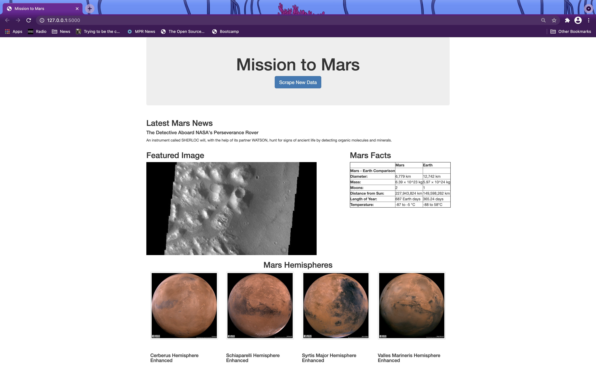

# web-scraping-challenge
This is the twelfth homework for the Data Analytics and Visualization Bootcamp through the University of Minnesota. This project scrapes data from several websites with information and images of Mars, saves it to a mongo database, and then uses a flask server to display the HTML file. 

## Data scraping
Code was written using a jupyter notebook to scrape information from four websites with information and images of Mars. 
Scraping was done with splinter for most sites. For the mars facts the table function was used as well as the df.to_html() function.
Data that was scraped as well as urls to images were then saved to a dictionary, which was connected to pyMongo.
The jupyter notebook was exported to a python file and renamed.

## Flask
app.py was built to import Flask and connect the MongoDB scraping code (scrape_mars.py) using a function called scrape_info() 
data that was scraped was then saved into MongoDB.

### Open Flask Server
To run the code:
- Open a terminal or gitbash from the folder with the files. 
- Run "python app.py" in terminal/gitbash
Now your Flask server is running and you can copy the http://127.0.0.1:500 into a Chrome browser to continue. 

The button is active on the page and will run the scrape_info() function to refresh the page.

### The application will display like this:

 